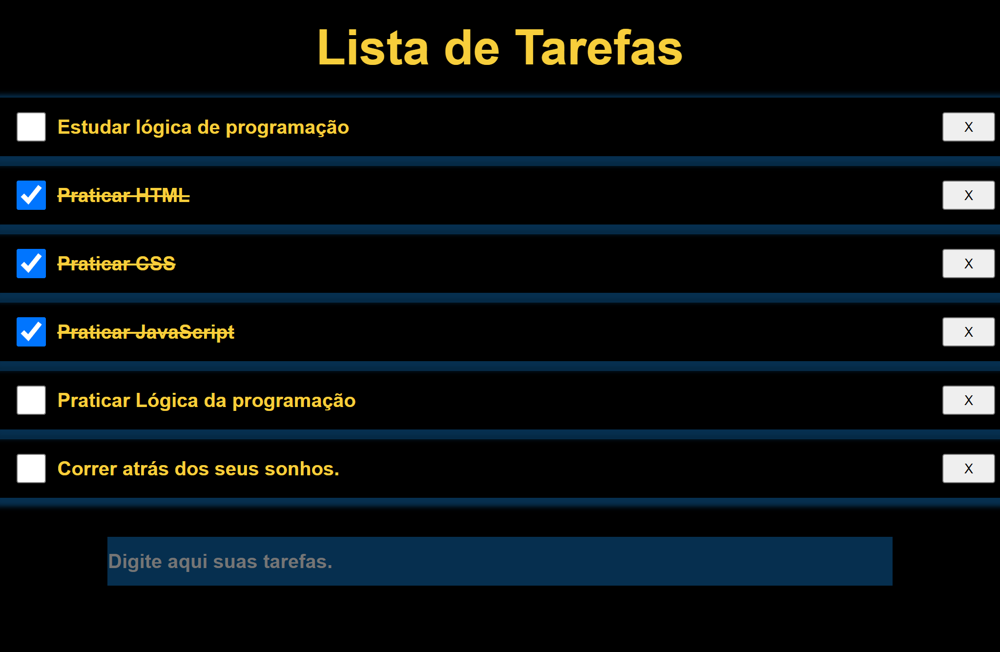

# Lista de tarefas

>Lista de tarefas com as funções de:
>>- Adicionar nova tarefa.
>>- concluir uma tarefa.
>>- Remover tarefa concluida ou nao concluida.
>>- Banco de dados local, podendo atualizar sem perder o progresso.

# 🛠️ Tecnologias

- HTML
- CSS
- JavaScript